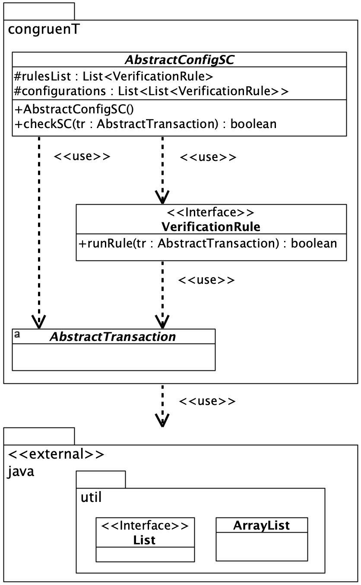
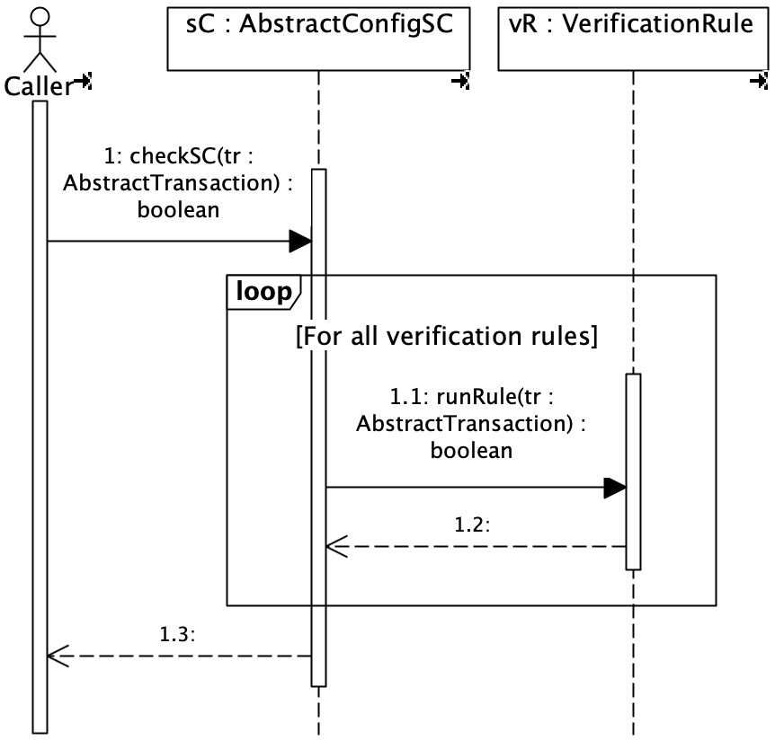

# CongruenT

The package provides an implementation of the CongruenT smart contract pattern for checking multiple transaction types. An explicit declaration of verification rules ensures their reuse in various smart contracts. The package delivers a standard method for verifying transactions in a smart contract. 

## The package structure

The package structure includes the abstract layer, which is a reusable component that can be utilized in smart contract development projects.

The abstract layer of the CongruenT package consists of the following classes:
* ``AbstractConfigSC`` class --- an abstract class of a smart contract that verifies multiple types of transactions. The class operates on multiple configurations of verification rules, each of which corresponds to one type of transaction verified by this smart contract.
* ``VerificationRule`` interface --- an interface for a verification rule in a smart contract configuration.
* ``AbstractTransaction`` class --- an abstract class of a general transaction.

The verification function is implemented in the abstract layer. This way, the software exposes a uniform interface while hiding the business logic of actual smart contracts.

## Package classes

The figure below presents the UML Class diagram with abstract classes in the CongruenT package.

  

## Checking transactions

The figure below shows the UML Sequence diagram for the ``checkSC()`` method invocation in the abstract layer.

  

