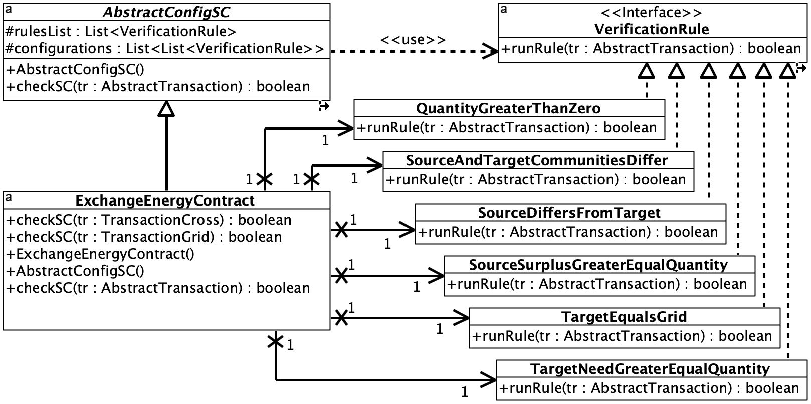

# CongruenT

The package provides an implementation of the CongruenT smart contract pattern for checking multiple transaction types. An explicit declaration of verification rules ensures their reuse in various smart contracts. The package delivers a standard method for verifying transactions in a smart contract. 

## The package structure

The package structure includes the abstract layer, which is a reusable component that can be utilized in smart contract development projects.

The abstract layer of the CongruenT package consists of the following classes:
* ``AbstractConfigSC`` class --- an abstract class of a smart contract that verifies multiple types of transactions. The class operates on multiple configurations of verification rules, each of which corresponds to one type of transaction verified by this smart contract.
* ``VerificationRule`` interface --- an interface for a verification rule in a smart contract configuration.
* ``AbstractTransaction`` class --- an abstract class of a general transaction.

The verification function is implemented in the abstract layer. This way, the software exposes a uniform interface while hiding the business logic of actual smart contracts.

## Package classes

The figure below presents the UML Class diagram with abstract classes in the CongruenT package.

  

## Checking transactions

The figure below shows the UML Sequence diagram for the ``checkSC()`` method invocation in the abstract layer.

  

In the abstract layer, an implementation of the ``checkSC()`` method for an abstract transaction and a single configuration is provided. For a single configuration, no additional implementation of this method is required in actual smart contracts. For multiple configurations, you need to overload the ``checkSC()`` method in the specific smart contract class for additional verification rule configurations. 

A specific smart contract contains a single list of verification rule objects and a list of configurations for each transaction type supported by that smart contract. The smart contract's execution for the basic transaction type is performed using methods implemented in an abstract class. Support for additional transaction types is implemented using overloaded methods in the specific smart contract. The flow of transaction validation is as follows. Calling the ``checkSC()`` method with a transaction as a parameter selects the overloaded ``checkSC()`` method appropriate for the object type of that transaction. The polymorphism feature of the object-oriented approach is used. The list of verification rules for the considered transaction type is then iterated, and the ``runRule()`` method is called on each of the verification rule objects in that configuration.

## Illustrative example

The ``ExchangeEnergyContract`` was implemented as an example of a smart contract validating multiple transaction types. The smart contract validates the following transaction classes: ``TransactionIn``, ``TransactionGrid``, and ``TransactionCross``.

Six classes of verification rules have been created, which are needed in the ``ExchangeEnergyContract`` smart contract class:
* ``QuantityGreaterThanZero`` class --- a verification rule that checks whether the energy quantity is greater than zero,
* ``SourceAndTargetCommunitiesDiffer`` class --- a verification rule that checks whether the source and the target communities are different,
* ``SourceDiffersFromTarget`` class --- a verification rule that checks whether the source and the target are different,
* ``SourceSurplusGreaterEqualQuantity`` class --- a verification rule that checks whether the source surplus is greater than or equal to the energy quantity,
* ``TargetEqualsGrid`` class --- a verification rule that checks whether the target is the energy grid,
* ``TargetNeedGreaterEqualQuantity`` class --- a verification rule that checks whether the target energy need is greater than or equal to the energy quantity.

The figure below presents the UML Class diagram showing the concrete smart contract with verification rule classes.

  

For each type of transaction, a different set of verification rules is checked, managed by the appropriate configuration.

For transaction type ``TransactionIn``, the following rules are checked: ``SourceDiffersFromTarget``, ``QuantityGreaterThanZero``, ``SourceSurplusGreaterEqualQuantity``.

Moreover, for transaction type ``TransactionGrid``, the following rules are examined: ``SourceDiffersFromTarget``, ``QuantityGreaterThanZero``, ``SourceSurplusGreaterEqualQuantity``, ``TargetEqualsGrid``.

Whereas for transaction type ``TransactionCross``, the following rules are verified: ``SourceAndTargetCommunitiesDiffer``, ``SourceDiffersFromTarget``, ``QuantityGreaterThanZero``, ``SourceSurplusGreaterEqualQuantity``, ``TargetNeedGreaterEqualQuantity``.

## Tests

Using the SmarTS v2.0 package, for the ``ExchangeEnergyContract`` smart contract class, the ``TestExchangeEnergySC`` testing class was implemented, which inherits from the ``AbstractTestConfigSC`` class. The ``TestExchangeEnergySC`` class implements the ``initiateTransactions()`` method, which invokes all the necessary transaction classes to test all types of verified transactions. According to the ``k+1`` testing method, for a smart contract with k verification rules, k+1 test transactions must be prepared. For each transaction type, one test transaction contains correct values for all verification rules. The next k transactions contain correct values for k-1 verification rules and one incorrect value for one verification rule. In each of these k test transactions, a different parameter is set to an incorrect value to test each verification rule individually. In the case of the ``ExchangeEnergyContract`` smart contract, there are three transaction types with the following numbers of verification rules: TransactionIn - 3, TransactionCross - 4, TransactionGrid - 5. Therefore, a total of 15 test transactions was prepared.

## Running the Example

The package and example were implemented in IntelliJ IDEA Community Edition.

To test the smart contract's functionality for the three transaction types under consideration, run the ``RunTestSuite`` class.
